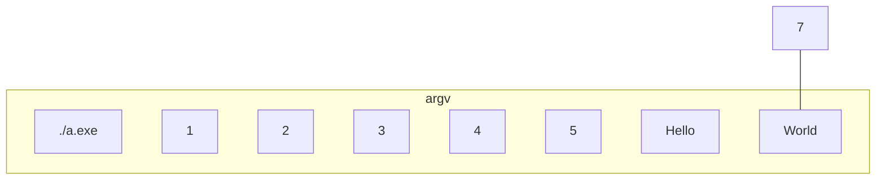

# Args

```cpp
int main(int argc, char * argv[]) {
    // Do somthing with this program
}
```

## `argc` and `argv`?

```bash
./a.exe 1 2 3 4 5 Hello World
```



## "Simple" Program to print all `argv`

```cpp
#include <iostream>
using namespace std;

int main(int argc, char *argv[]) {
    for (int i = 0; i < argc; i++)
        cout << "argv[" << i << "] = " << argv[i] << endl;
}
```

Ref: _[argv.cpp](./Code/argv.cpp)_

## Converting argv to `int` / `float`

### ASCII to integer (`atoi`)

Convert string to an integer, return 0 if it's not convertible

```cpp
#include <iostream>
using namespace std;

int main(int argc, char *argv[]) {
    for (int i = 0; i < argc; i++)
        cout << "atoi(argv[" << i << "]) = " << atoi(argv[i]) << endl;
}
```

Ref: _[atoi.cpp](./Code/atoi.cpp)_

### ASCII to float (`atof`)

Similar to `atoi`. Convert string to an float, return 0.0 if it's not convertible

```cpp
#include <iostream>
using namespace std;

int main(int argc, char *argv[]) {
    for (int i = 0; i < argc; i++)
        cout << "atoi(argv[" << i << "]) = " << atoi(argv[i]) << endl;
}
```

Ref: _[atof.cpp](./Code/atof.cpp)_

## Program that prints sum of all args:

<details>

<summary>Implementation Code</summary>

```cpp
#include <iostream>
using namespace std;

int main(int argc, char *argv[]) {
    float sum = 0;
    for (int i = 1; i < argc; i++)
        sum += atof(argv[i]);
    cout << sum << endl;
}
```

Ref: _[sumArgs.cpp](./Code/sumArgs.cpp)_

</details>

## Why do we use this instead of `cin` / `scanf`?

```py
import os

os.system("sum.exe 1 2 3 4 5")
```

Ref: _[otherProgram.py](./Code/otherProgram.py)_
