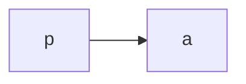
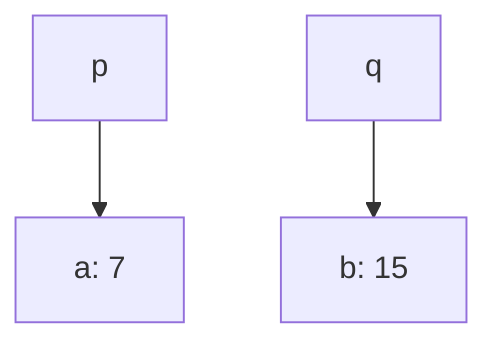

# The meaning of `*` and `&`

## Simple pointer code

```cpp
#include <iostream>
using namespace std;

int main() {
    int a;
    int *p;

    p = &a;
}
```



Ref: _[pointer1.cpp](./Code/pointer1.cpp)_

## A little more complicated example

```cpp
#include <iostream>
using namespace std;

int main() {
    int a, b;
    int *p, *q;

    p = &a;
    q = &b;

    a = 5;

    *q = *p + 10;

    (*p)+=2;
}
```



Ref: _[pointer2.cpp](./Code/pointer2.cpp)_
