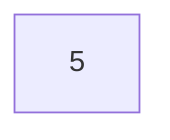
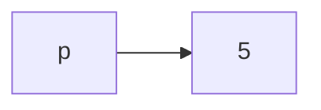

# Memory leak is 💀

Normally when we declare a variable, it needs a space in the memory (RAM) and we can later use that memory by calling that variable.

The `new` keyword is a bit different. It does take up the space in the RAM but you have to reference to that space by using a pointer.

```cpp
#include <iostream>
using namespace std;

int main()
{
    new int(5);
}
```



Ref: _[new1.cpp](./Code/new1.cpp)_

The code shown above can be run and it does take space in RAM, but we cannot reference back to that address.

The solution is to use a pointer.

```cpp
#include <iostream>
using namespace std;

int main()
{
    int *p = new int(5);

    cout << *p << endl;
    cout << *p + 1 << endl;
}
```



Ref: _[new2.cpp](./Code/new2.cpp)_

**Note:** `new int(5)` means create `int` with value `5`, but `new int[5]` means create `int` array with 5 elements

## Delete

`delete` is used to free up memory. This is only valid if the specified memory was declared using `new` keyword.

### ✅ Do

```cpp
int * p = new int(5);
delete p;
```

### ❌ Don't

```cpp
int a = 5;
int * p = &a;
delete p;
```

## `new` and `delete` with array

```cpp
int * p = new int[5];
delete [] p;
```

## Beware of Memory Leak!!!

What is the difference between Code 1 and Code 2?

Code 1:

```cpp
for(int i=0;i<10;i++) {
    int a[10];
}
```

Code 2:

```cpp
for(int i=0;i<10;i++) {
    int *p = new int[10];
}
```

For Code 1, the memory is cleared when each iteration of for-loop ends.

For Code2, the memory is <u>NOT</u> cleared after the loop ends even we lost the reference to that `int` already.

We should delete the allocated memory in each iteration.

```cpp
for(int i=0;i<10;i++) {
    int *p = new int[10];

    /* Do something */

    delete [] p;
}
```

<u>Note:</u> **Always** go back to index 0 before deleting the array.
