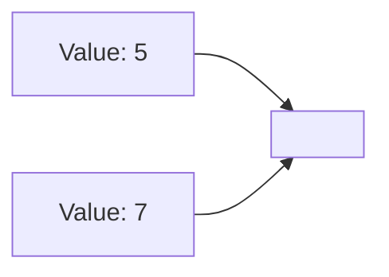

# Self referencing pointer

```cpp
class Node {
public:
    int value;
    Node * next = NULL;
};
```

## Visualising a Node


```mermaid
graph LR;

    0x01[Value: 5]-->NULL[ ];
    0x02[Value: 7]-->NULL[ ];

```
