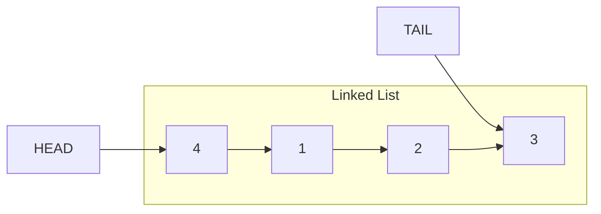

# Linked List

## Linked list vs Array

### Linked List

- Dynamic size
- Can insert in-between instantly
- Needs to track from first to each element; cannot access each element instantly

### Array

- Fixed size
- Need to move elements one by one to insert an element in-between
- Can access each element instantly

```cpp
class LinkedList {
public:
    Node * head = NULL;
    Node * tail = NULL;
    void insertBack(int n);
    void insertFront(int n);
    void printAll();
};
```



## Implementation of inserting to the back

```cpp
void LinkedList::insertBack(int n)
{
    Node *node = new Node(n);
    if (head == NULL)
        head = tail = node;
    else
    {
        tail->next = node;
        tail = node;
    }
}
```

## Implementation of inserting to the front

```cpp
void LinkedList::insertFront(int n)
{
    Node *node = new Node(n);
    if (head == NULL)
        head = tail = node;
    node->next = head;
    head = node;
}
```

## Printing all elements in linked list

```cpp
void LinkedList::printAll()
{
    for (Node *temp = head; temp != NULL; temp = temp->next)
        cout << temp->value << " -> ";
    cout << endl;
}
```

Ref: _[linkedList.cpp](./Code/linkedList.cpp)_

## <u>Sorted Linked List?</u>

Class Node:

```cpp
class Node
{
public:
    int value;
    Node *next = NULL;
    Node(int n) { value = n; }
};
```

Class LinkedList:

```cpp
class LinkedList
{
public:
    Node *head = NULL;
    void insert(int n);
    void printAll();
};
```

```cpp
void LinkedList::printAll()
{
    for (Node *temp = head; temp != NULL; temp = temp->next)
        cout << temp->value << " -> ";
    cout << "X" << endl;
}
```

```cpp
void LinkedList::insert(int n)
{
    Node *node = new Node(n);

    // First element
    if (head == NULL)
    {
        head = node;
        return;
    }

    // Head is larger than the new node
    if (head->value > n)
    {
        node->next = head;
        head = node;
        return;
    }

    // More than one element
    Node *temp = head;
    while (temp->next != NULL && temp->next->value < n)
        temp = temp->next;

    node->next = temp->next;
    temp->next = node;
}
```

```cpp
int main(int argc, char *argv[])
{
    LinkedList ll;
    for (int i = 1; i < argc; i++)
    {
        ll.insert(atoi(argv[i]));
        ll.printAll();
    }
}
```

Ref: _[sortedLL.cpp](./Code/sortedLL.cpp)_


Try writing doubly linked list:

